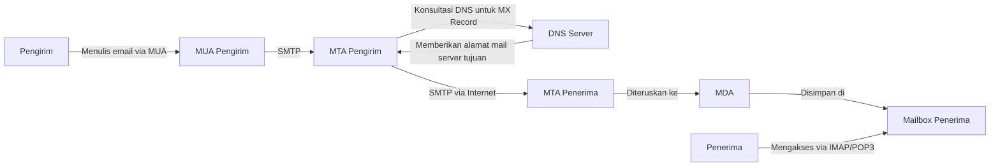

<div align="center">

# RANGKUMAN KOMPREHENSIF TENTANG EMAIL
## Nama  : Alif Aditya
## NRP : 3123600016

**Workshop Administrasi Jaringan**

</div>

---

## 📧 Pengertian Email

Email (Electronic Mail) adalah metode pertukaran pesan digital antar pengguna melalui jaringan komputer, terutama internet. Sistem ini memungkinkan pengiriman pesan teks, gambar, dan berbagai jenis lampiran secara instan ke seluruh dunia.

---

## 🔧 Protokol Utama dalam Sistem Email

### 1. SMTP (Simple Mail Transfer Protocol)
- **Fungsi**: Digunakan untuk **mengirim** email dari klien ke server atau antar server email
- **Karakteristik**: Hanya berfungsi untuk pengiriman, tidak untuk penerimaan
- **Port**: 
  - 25 (tanpa enkripsi) 
  - 587 (dengan TLS) 
  - 465 (dengan SSL)
- **Analogi**: Seperti kantor pos yang hanya menerima surat untuk dikirim

### 2. IMAP (Internet Message Access Protocol)
- **Fungsi**: Digunakan untuk **mengakses** email yang tersimpan di server
- **Karakteristik**: 
  - Email tetap tersimpan di server
  - Mendukung sinkronisasi multi-perangkat
  - Perubahan status email (dibaca/tidak) terlihat di semua perangkat
- **Port**: 
  - 143 (tanpa enkripsi) 
  - 993 (dengan SSL/TLS)
- **Keunggulan**: Ideal untuk pengguna dengan banyak perangkat
- **Analogi**: Seperti membaca buku di perpustakaan tanpa membawanya pulang

### 3. POP3 (Post Office Protocol version 3)
- **Fungsi**: Digunakan untuk **mengambil** email dari server ke klien
- **Karakteristik**: 
  - Email di-download ke perangkat lokal
  - Secara default, email dihapus dari server setelah diunduh
  - Cocok untuk penggunaan offline/satu perangkat
- **Port**: 
  - 110 (tanpa enkripsi) 
  - 995 (dengan SSL → POP3S)
- **Analogi**: Seperti mengambil surat dari kotak pos dan membawanya pulang

### 4. POP3S (POP3 Secure)
- **Fungsi**: Versi aman dari POP3 yang menggunakan enkripsi SSL
- **Karakteristik**: Menyediakan keamanan tambahan dengan enkripsi
- **Port**: 995
- **Keunggulan**: Melindungi konten email selama transmisi

---

## 🌐 Komponen Sistem Email

| Komponen | Deskripsi | Contoh |
|----------|-----------|--------|
| **Email Address** | Identitas unik pengguna email dengan format `username@domain.com` | user@example.com |
| **MUA (Mail User Agent)** | Aplikasi yang digunakan pengguna untuk membaca dan menulis email | Gmail, Outlook, Thunderbird |
| **MTA (Mail Transfer Agent)** | Server yang memproses dan mengirim email antar server | Postfix, Sendmail, Exchange |
| **MDA (Mail Delivery Agent)** | Komponen yang menyimpan email ke kotak masuk penerima | Dovecot, Procmail |
| **Mail Server** | Infrastruktur yang menjalankan layanan email | Google Mail Server, Microsoft Exchange |

---

## 🔄 Alur Kerja Pengiriman Email



### Langkah-langkah Detail:

1. **Penulisan Email**:
   - Pengguna menulis email menggunakan MUA (Mail User Agent)
   - Email disimpan sementara di spool lokal

2. **Pengiriman dari Klien ke Server**:
   - MUA mengirim email ke MTA (Mail Transfer Agent) menggunakan protokol SMTP
   - MTA menerima dan memproses email

3. **Pencarian Server Tujuan**:
   - MTA pengirim melakukan kueri DNS untuk mencari MX Record domain tujuan
   - MX Record menginformasikan server mana yang bertanggung jawab menerima email untuk domain tersebut

4. **Pengiriman antar Server**:
   - MTA pengirim mengirim email ke MTA penerima melalui internet menggunakan SMTP
   - Email mungkin melewati beberapa server relay dalam prosesnya

5. **Penerimaan dan Penyimpanan**:
   - MTA penerima menerima email dan meneruskannya ke MDA (Mail Delivery Agent)
   - MDA menyimpan email ke mailbox penerima sesuai dengan alamat tujuan
   - Alias Expander mungkin memproses email untuk pengalihan/penerusan

6. **Pengambilan oleh Penerima**:
   - Penerima mengakses mailbox menggunakan MUA
   - Email diambil menggunakan protokol IMAP atau POP3
   - Email dapat dibaca, dibalas, atau diteruskan

---

## 📝 Informasi Mail Server dalam DNS

### MX Record (Mail Exchange Record)

- **Fungsi**: Menentukan server mana yang bertugas menerima email untuk domain tertentu
- **Format**: Terdiri dari prioritas (angka) dan hostname mail server
- **Prioritas**: Nilai lebih rendah = prioritas lebih tinggi
- **Contoh Kueri**:
  ```bash
  dig MX example.com
  nslookup -q=MX domain.com 8.8.8.8
  ```

### Contoh Output MX Record:

```
example.com.    3600    IN    MX    10 mail1.example.com.
example.com.    3600    IN    MX    20 mail2.example.com.
```

Dalam contoh di atas:
- `mail1.example.com` adalah server email utama (prioritas 10)
- `mail2.example.com` adalah server cadangan (prioritas 20)
- Server dengan prioritas 10 akan dicoba terlebih dahulu

---

## 📨 Istilah Umum dalam Email

- **To**: Penerima utama email
- **Cc** (Carbon Copy): Penerima salinan email (terlihat oleh semua penerima)
- **Bcc** (Blind Carbon Copy): Penerima salinan tersembunyi (tidak terlihat oleh penerima lain)
- **Subject**: Judul atau topik email
- **Body**: Isi pesan email
- **Attachment**: File yang dilampirkan pada email
- **Signature**: Tanda tangan digital di akhir email
- **Thread**: Rangkaian email terkait dalam satu topik pembahasan
- **Inbox**: Folder untuk email masuk
- **Outbox**: Folder untuk email yang sedang dalam proses pengiriman
- **Sent**: Folder untuk email yang telah berhasil dikirim
- **Draft**: Folder untuk email yang belum selesai ditulis
- **Spam/Junk**: Folder untuk email yang dianggap sampah/tidak penting
- **Trash**: Folder untuk email yang telah dihapus

---

## 📊 Perbandingan Protokol Email

| Fitur | SMTP | IMAP | POP3 |
|-------|------|------|------|
| **Fungsi Utama** | Mengirim email | Mengakses email | Mengunduh email |
| **Email Disimpan** | N/A | Di server | Di perangkat lokal |
| **Multi-perangkat** | N/A | Ya | Terbatas |
| **Penggunaan Offline** | Tidak | Terbatas | Ya |
| **Port (Non-enkripsi)** | 25 | 143 | 110 |
| **Port (Enkripsi)** | 587 (TLS), 465 (SSL) | 993 (SSL) | 995 (SSL) |

---

## ✅ Kelebihan Email

- Pengiriman pesan cepat dan instan
- Biaya rendah dibandingkan komunikasi fisik
- Mendukung berbagai jenis lampiran
- Jangkauan global
- Penyimpanan dan pengarsipan digital
- Kemampuan pencarian dan pengorganisasian
- Pengiriman massal memungkinkan

## ❌ Kekurangan Email

- Rentan terhadap spam dan phishing
- Masalah keamanan dan privasi
- Kemungkinan terinfeksi malware/virus
- Ketergantungan pada koneksi internet
- Batasan ukuran lampiran
- Risiko kesalahpahaman komunikasi
- Overload informasi

---

## 🔒 Keamanan Email

### Teknologi Keamanan

- **SPF** (Sender Policy Framework): Memverifikasi domain pengirim
- **DKIM** (DomainKeys Identified Mail): Menambahkan tanda tangan digital pada email
- **DMARC** (Domain-based Message Authentication): Menggabungkan SPF dan DKIM
- **TLS** (Transport Layer Security): Mengenkripsi komunikasi email
- **S/MIME**: Mengenkripsi isi email dan menambahkan tanda tangan digital
- **PGP** (Pretty Good Privacy): Enkripsi end-to-end untuk email

### Praktik Keamanan Terbaik

- Gunakan password yang kuat
- Aktifkan autentikasi dua faktor
- Jangan membuka lampiran mencurigakan
- Hati-hati dengan permintaan informasi pribadi
- Verifikasi identitas pengirim sebelum merespons
- Gunakan layanan email yang menerapkan enkripsi

---

## 📚 Referensi

1. RFC 5321 - Simple Mail Transfer Protocol
2. RFC 3501 - Internet Message Access Protocol
3. RFC 1939 - Post Office Protocol - Version 3
4. GeeksforGeeks - Introduction to Electronic Mail
5. GitHub - Workshop Administrasi Jaringan

---

<div align="center">
<i>Rangkuman ini dibuat untuk membantu pemahaman konsep dan mekanisme email dalam konteks administrasi jaringan.</i>
</div>
